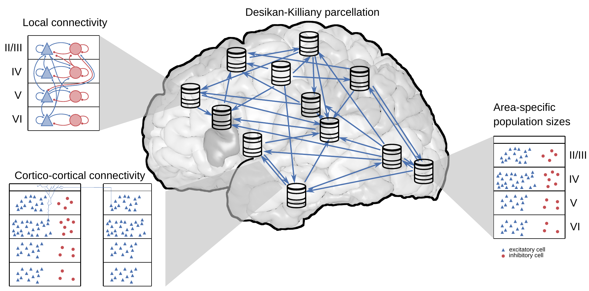
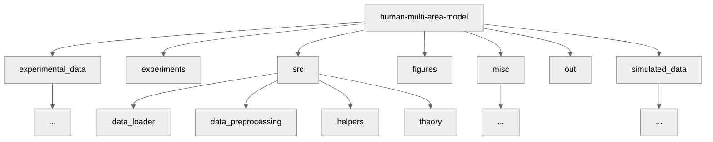

# Multi-Scale Spiking Network Model of Human Cerebral Cortex

This code implements the multi-scale spiking network model known as the Human Multi-Area Model (**HuMAM**) developed at the Institute for Advanced Simulation (IAS-6), Forschungszentrum Jülich. The model has been documented in the following publication:

- [1] Pronold, J., Meegen, A. van, Shimoura, R. O., Vollenbröker, H., Senden, M., Hilgetag, C. C., Bakker, R., & Albada, S. J. (2024). Multi-scale spiking network model of human cerebral cortex. Cerebral Cortex. [https://doi.org/10.1093/cercor/bhae409](https://doi.org/10.1093/cercor/bhae409).



**Model overview**: The model comprises all 34 areas of the Desikan-Killiany parcellation in one hemisphere of human cerebral cortex. Each area is modeled by a column with 1 $mm^{2}$ cortical surface. Within each column, the full number of neurons and synapses based on anatomical data is included. In total, this leads to 3.47 million neurons and 42.8 billion synapses. Both the intrinsic and the cortico-cortical connectivity are layer- and population-specific.

## Table of contents
- [Multi-Scale Spiking Network Model of Human Cerebral Cortex](#multi-scale-spiking-network-model-of-human-cerebral-cortex)
  - [Table of contents](#table-of-contents)
  - [Try it on EBRAINS](#try-it-on-ebrains)
    - [User instructions](#user-instructions)
      - [Try it on EBRAINS](#try-it-on-ebrains-1)
      - [Fork the repository and save your changes](#fork-the-repository-and-save-your-changes)
  - [Prerequisites](#prerequisites)
    - [Data](#data)
    - [Requirements](#requirements)
  - [Installation](#installation)
    - [Python modules using Mamba](#python-modules-using-mamba)
      - [On a local machine](#on-a-local-machine)
      - [On a cluster](#on-a-cluster)
    - [NEST installation](#nest-installation)
  - [Code repository](#code-repository)
  - [How to run](#how-to-run)
    - [Configuration](#configuration)
    - [Run on a cluster](#run-on-a-cluster)
    - [Ploting figures](#ploting-figures)
  - [Collaborators](#collaborators)
  - [Acknowledgments](#acknowledgments)
  - [How to contribute](#how-to-contribute)
  - [How to ask questions](#how-to-ask-questions)
  - [How to cite](#how-to-cite)

## Try it on EBRAINS

Do you want to start using or simply run the model? Click the button below.

<a href="https://lab.ebrains.eu/hub/user-redirect/git-pull?repo=https%3A%2F%2Fgithub.com%2FINM-6%2Fhuman-multi-area-model.git&urlpath=lab%2Ftree%2Fhuman-multi-area-model.git%2Fhumam_tutorial.ipynb&branch=main"> </a>

**Please note**: make sure you check and follow our User instructions, especially if you plan to make and save the changes, or if you need step-by-step instructions.

--------------------------------------------------------------------------------

### User instructions
The Jupyter Notebook `humam_tutorial.ipynb` illustrates the simulation workflow with a down-scaled version of the human multi-area model. This notebook can be explored and executed online in the Jupyter Lab provided by EBRAINS without the need to install any software yourself. However, if you prefer to try on your local computer, then skip to [Installation](#installation) section. 

* Prerequisites: an [EBRAINS](https://www.ebrains.eu/) account. If you don’t have it yet, register at [register page](https://iam.ebrains.eu/auth/realms/hbp/protocol/openid-connect/registrations?response_type=code&client_id=xwiki&redirect_uri=https://wiki.ebrains.eu). Please note: registering an EBRAINS account requires an institutional email.<br>
* If you plan to only run the model, instead of making and saving changes you made, go to [Try it on EBRAINS](#try-it-on-ebrains-1); Should you want to adjust the parameters, save the changes you made, go to [Fork the repository and save your changes](#fork-the-repository-and-save-your-changes).

#### Try it on EBRAINS
1. Click [Try it on EBRAINS](https://lab.ebrains.eu/hub/user-redirect/git-pull?repo=https%3A%2F%2Fgithub.com%2FINM-6%2Fhuman-multi-area-model.git&urlpath=lab%2Ftree%2Fhuman-multi-area-model.git%2Fhumam_tutorial.ipynb&branch=main). If any error or unexpected happens during the following process, please close the browser tab and restart the [User instruction](https://lab.ebrains.eu/hub/user-redirect/git-pull?repo=https%3A%2F%2Fgithub.com%2Fshimoura%2Fhuman-multi-area-model.git&urlpath=lab%2Ftree%2Fhuman-multi-area-model.git%2Fhumam_tutorial.ipynb&branch=add-downscaling-factor) process again.
2. On the `Lab Execution Site` page, select a computing center from the given list.
3. If you’re using EBRAINS for the first time, click `Sign in with GenericOAuth2` to sign in on EBRAINS. To do this, you need an EBRAINS account.
4. Once signed in, on the `Server Options` page, choose `Official EBRAINS Docker image 23.06 for Collaboratory.Lab (recommended)`, and click `start`.
5. Once succeeded, you’re now at a Jupyter Notebook named `humam_tutorial.ipynb`. Click the field that displays `Python 3 (ipykernel)` in the upper right corner and switch the `kernel` to `EBRAINS-24.04`.
6. Congratulations! Now you can run the model. Enjoy!<br> To run the model, click the `Run` on the title bar and choose `Run All Cells`. It takes several minutes until you get all results.<br>
**Please note**: every time you click the `Try it on EBRAINS` button, the repository is loaded into your home directory on EBRAINS Lab and it overrides your old repository with the same name. Therefore, make sure you follow the [Fork the repository and save your changes](#fork-the-repository-and-save-your-changes) if you make changes and want to save them.
 
#### Fork the repository and save your changes
With limited resources, EBRAINS Lab regularly deletes and cleans data loaded on the server. This means the repository on the EBRAINS Lab will be periodically deleted. To save changes you made, make sure you fork the repository to your own GitHub, then clone it to the EBRAINS Lab, and do git commits and push changes.
1. Go to our [Human Multi-Area Model](https://github.com/INM-6/human-multi-area-model), create a fork by clicking the `Fork`. In the `Owner` field, choose your username and click `Create fork`. Copy the address of your fork by clicking on `Code`, `HTTPS`, and then the copy icon.
2. Go to [EBRAINS Lab](https://lab.de.ebrains.eu), log in, and select a computing center from the given list.
3. In the Jupyter Lab, click on the `Git` icon on the left toolbar, click `Clone a Repository` and paste the address of your fork.
4. Now your forked repository of human multi-area model is loaded on the server. Enter the folder `human-multi-area-model` and open the notebook `humam_tutorial.ipynb.ipynb`.
5. Click the field that displays `Python 3 (ipykernel)` in the upper right corner and switch the `kernel` to `EBRAINS-24.04`.
6. Run the notebook! To run the model, click the `Run` on the title bar and choose `Run All Cells`. It takes several minutes until you get all results. 
7. You can modify the exposed parameters before running the model. If you want to save the changes you made, press `Control+S` on the keyboard, click the `Git` icon on the most left toolbar, do git commits and push.<br> 
To commit, on `Changed` bar, click the `+` icon, fill in a comment in the `Summary (Control+Enter to commit)` at lower left corner and click `COMMIT`.<br> 
To push, click the `Push committed changes` icon at upper left which looks like cloud, you may be asked to enter your username and password (user name is your GitHUb username, password should be [Personal access tokens](https://github.com/settings/tokens) you generated on your GitHub account, make sure you select the `repo` option when you generate the token), enter them and click `Ok`.

--------------------------------------------------------------------------------

## Prerequisites
### Data

Data extracted from experimental references and necessary to run the codes can be found in [experimental_data/](./experimental_data/) folder. These files will be automatically loaded when running the simulation (check section [How to run](#how-to-run) for details).

Please note that some data has to be manually downloaded. Specifically, the data stored in `./experimental_data/macaque/` and `./experimental_data/rutishauser/`. Both data are only required for specific plots, not being necessary to run the examples presented here.

### Requirements

The entire workflow of the model, from data preprocessing through the simulation to the final analysis, relies on the `Python` programming language. The complete list of Python packages with the specific version we used to run our simulations can be found in ```humam.yml``` file. Other package versions may not work properly.

Note: All network simulations in [Pronold et al. (2024)](#1) were performed using the `NEST simulator` version `2.20.2` (https://www.nest-simulator.org/). To run this version, please check the code released for HuMAM versions below 2.0.0.

## Installation

### Python modules using Mamba
The Python modules can be installed with the [Mamba](https://mamba.readthedocs.io/en/latest/installation/mamba-installation.html) data science platform (similar to `conda` but faster) or via its free minimal installer called [Micromamba](https://mamba.readthedocs.io/en/latest/installation/micromamba-installation.html). 

#### On a local machine
All dependencies are handled using ```mamba```. 

On a local computer, simply run:
```
mamba env create -f humam.yml
```  
This command will create an environment and automatically install all Python packages defined in the ```humam.yml``` file. 

Once installed, you can activate your environment with:
```
mamba activate humam
```

From this step, you are already ready to test the model by running the downscaled example in `humam_tutorial.ipynb`.

#### On a cluster

On a cluster, ```snakemake``` can automatically create the mamba/conda environment for you if you add the `--use-conda` option to `snakemake_slurm.sh`. For this, first, remove the `- nest-simulator` dependency from ```humam.yml```. Once ```NEST simulator``` is not included in this file, you can install NEST via the instructions below.

Depending on your cluster configuration, it can be better to use the modules already installed in the system rather than installing the packages via mamba/conda. More details in ["How to run"](#how-to-run) section.  

### NEST installation

All different methods to install NEST can be found in their extensive documentation: https://nest-simulator.readthedocs.io/en/stable/installation/index.html. 

**If using HuMAM below v2.0.0**: In our published results, we used the "Install NEST from source" option with NEST ```2.20.2``` version. Note: after the step to clone nest-simulator from GitHub, change the branch with: ```git checkout v2.20.2```. <br>
**Current version**: The latest version of our code (Release version of HuMAM from 2.0.0 onwards) was tested using NEST ```3.8```.

The NEST installation path will have to be specified in `config.yaml` described in the ["How to run"](#how-to-run) section.

## Code repository

Folder structure:



| directory | description |
| --- | --- |
| [./experimental_data/](./experimental_data/) | contains experimental datasets used for building the network and for comparing results |
| [./experiments/](./experiments/) | contains Python scripts that set the model parameters for different simulation experiments |
| [./figures/](./figures/) | output directory for figures |
| [./misc/](./misc/) | includes supplementary files such as code documentation ([/docs](./misc/docs/)), matplotlib style files ([/mplstyles](./misc/mplstyles/)), and other experiment files ([/experiments](./misc/experiments/))
| [./out/](./out/) | directory where the simulation output is stored |
| [./src/](./src/) | main directory with python scripts to run the network simulation |
| [./simulated_data/](./simulated_data/) | simulated data generated from scaling experiments |

Brief description of the main files in [./src/](./src/) directory:

| script | description |
| --- | --- |
| `./network.py` | python class that gathers and prepares all data for setting up the NEST simulation |
| `./simulation.py` | python class that sets and builds the network for running the simulations |
| `./analysis.py` | python class that provides functions to analyze simulation results |
| `./default_` | scripts that define the default network, simulation, and analysis parameter dictionaries |
| `./snakemake_` | helper scripts which use an `experiment.py` file to create, simulate, and analyze the network |
| `./figure_` | scripts that plot specific figures showed in our publication [1] |
| `./compute_` | scripts to compute the scaling experiment |
  
Additionally, in [./src/](./src/) directory you can also find the following subfolders:
| directory | description |
| --- | --- |
| [./src/data_loader/](./src/data_loader/) | contains auxiliary scripts for loading the data used for building the network |
| [./src/data_preprocessing/](./src/data_preprocessing/) | contains auxiliary scripts for preprocessing the data used for building the network |
| [./src/helpers](./src/helpers/) | contains auxiliary helper scripts |
| [./src/theory/](./src/theory/) | contains the scripts used for the mean-field analysis |

## How to run

The example below shows how to prepare the configuration files and how to run the code. 
**Note**: For a simplified version of the workflow and to test the code on a local machine, you can follow the instructions in the [Installation](#installation) section and skip the next instructions.

All the workflow is managed using the [Snakemake](https://snakemake.readthedocs.io/en/stable/#) tool. To run different network setups or experiments, the user has only to set the parameters in a Python script (two examples are shown in [./experiments/](./experiments/)) and simulate following the instructions below.

### Configuration

Create a `config.yaml` file inside the repository's main directory. An example is shown in `config_jureca.yaml`. Please note that the NEST path should be given as: `<path_to_NEST_installation>/install/`. 
If running in a cluster, you must also define the cluster configurations on the `cluster.json` file. An example is also given, but you should modify it accordingly with your cluster configuration.

### Run on a cluster

To run the model on a cluster, ensure you have a working `snakemake` installation and type: 

```
bash snakemake_slurm.sh
```

**NOTE**: to run the current version on JURECA cluster (Jülich Supercomputing Centre at Forschungszentrum Jülich), it is recommended to use the modules defined in `config_jureca.yaml` file instead of the mamba/conda environment. If so, make sure the `--use-conda` flag is not in the `snakemake_slurm.sh` script before running the code line above.

This script will run the workflow defined in `Snakefile`, which follows the sequence:
1. read all `*.py` experiment files contained in the `./experiments/` directory. **NOTE**: If you want to run fewer/more experiments, remove/add these files from the `./experiments/` directory.
2. load necessary modules for MPI and NEST before executing
3. create the network
4. simulate the network
5. analyse the results from simulation

By default, the resulting simulation data will be stored in the `./out` directory. For each experiment, different information regarding network, simulation, and analysis details will be stored following this structure:

`./out/<network_hash>/<simulation_hash>/<analysis_hash>`

The hash identifiers are automatically generated based on the set of parameters defined on the network, simulation, and analysis dictionaries.

### Ploting figures

After running the complete workflow described in ["Run on a cluster"](###run-on-a-cluster) section, you can find the raster plots and other figures automatically generated from the simulation results in

`./out/<network_hash>/<simulation_hash>/<analysis_hash>/plots/` 

Other figures shown in [1] can be manually plotted using the scripts in `./src/` named as "figure_*". These figures are stored at `./figures/`. For instance, after running the ground and best-fit state experiments, from the main directory you can plot figures 4 and 6 presented in [1] by running the script:

```
python src/figure_spike_statistics.py
```

## Collaborators

The scientific content contributions were made by the authors of the publication [1]: Jari Pronold, Alexander van Meegen, Renan O. Shimoura, Hannah Vollenbröker, Mario Senden, Claus C. Hilgetag, Rembrandt Bakker, and Sacha J. van Albada.

## Acknowledgments
We thank Sebastian Bludau and Timo Dickscheid for helpful discussions about cytoarchitecture and parcellations. Furthermore, we gratefully acknowledge all the shared experimental data that underlies our work, and the effort spent to collect it.

This work was supported by the German Research Foundation (DFG) Priority Program “Computational Connectomics” (SPP 2041; Project 347572269), the European Union’s Horizon 2020 Framework Programme for Research and Innovation under Specific Grant Agreement No. 945539 (Human Brain Project SGA3), the European Union’s Horizon Europe Programme under the Specific Grant Agreement No. 101147319 (EBRAINS 2.0 Project), the Joint Lab “Supercomputing and Modeling for the Human Brain”, and HiRSE_PS, the Helmholtz Platform for Research Software Engineering - Preparatory Study, an innovation pool project of the Helmholtz Association. The use of the JURECA-DC supercomputer in Jülich was made possible through VSR computation time grant JINB33 (“Brain-Scale Simulations”). Open access publication funded by the German Research Foundation (DFG), project 491111487.

## How to contribute

We welcome contributions to the human-multi-area-model project! Here are the steps to get started:

1. **Fork the repository**: Click the "Fork" button at the top right of this page and create a copy of the repository in your own GitHub account.
2. **Clone your fork**: Clone the forked repository to your local machine using `git clone <URL-of-your-fork>`.
3. **Create a branch**: Create a new branch for your feature or bug fix using `git checkout -b <branch-name>`.
4. **Make changes**: Make your changes to the code or documentation.
5. **Commit changes**: Commit your changes with a clear and concise commit message using `git commit -m "Description of changes"`.
6. **Push changes**: Push your changes to your fork on GitHub using `git push origin <branch-name>`.
7. **Submit a pull request**: Go to the original repository and open a pull request. Provide a clear description of the changes and link to any relevant issues.

Please ensure your code adheres to our coding standards. If you have any questions, feel free to open an issue or contact us directly.

Thank you for your contribution!

## How to ask questions

If you have any questions or need help, you can open an issue in the repository:

1. **Navigate to the Issues tab**: Click on the "Issues" tab at the top of the repository page.
2. **Click on New Issue**: Click the "New issue" button.
3. **Select a template**: Choose the appropriate issue template if available, or select "Open a blank issue".
4. **Fill in the details**: Provide a clear title and detailed description of your question or issue. Include any relevant information, such as steps to reproduce the problem, screenshots, or code snippets.
5. **Submit the issue**: Click the "Submit new issue" button to create the issue.

Our team will review your issue and respond as soon as possible. Thank you for reaching out!

## How to cite
If you use this code, please cite:
- Pronold, J., Meegen, A. van, Shimoura, R. O., Vollenbröker, H., Senden, M., Hilgetag, C. C., Bakker, R., & Albada, S. J. (2024). Multi-scale spiking network model of human cerebral cortex. Cerebral Cortex. [https://doi.org/10.1093/cercor/bhae409](https://doi.org/10.1093/cercor/bhae409).
